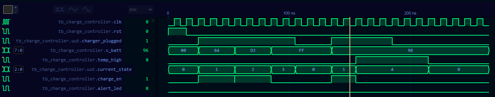

# LFP Battery Charge Controller (RTL Design & Verification)

## Tổng quan dự án (Overview)
Kho lưu trữ này chứa mã nguồn thiết kế phần cứng RTL và hệ thống kiểm chứng (Verification) cho bộ điều khiển sạc pin Lithium Iron Phosphate (LiFePO4 / LFP) thông minh. Hệ thống được xây dựng dựa trên máy trạng thái hữu hạn (Finite State Machine - FSM) sử dụng ngôn ngữ **Verilog HDL**, kết hợp môi trường Testbench chuyên sâu để kiểm chứng bằng công cụ **Icarus Verilog**.

Dự án mô phỏng quá trình sạc an toàn cho pin LFP, bao gồm việc quản lý các giai đoạn dòng điện không đổi (CC), điện áp không đổi (CV), trạng thái đầy và cơ chế ngắt khẩn cấp khi phát hiện lỗi quá nhiệt phần cứng.

## Cấu trúc thư mục (Directory Structure)
```text
lfp-battery-charge-controller/
│
├── rtl/
│   └── charge_controller.v     # Mã nguồn RTL thiết kế chính (FSM quản lý sạc, CC/CV, Fault)
├── sim/
│   ├── tb_charge_controller.v  # Môi trường Testbench kiểm chứng và tiêm lỗi (Fault Injection)
│   └── simulation.vcd          # Dữ liệu dạng sóng mô phỏng (Value Change Dump)
├── doc/
│   └── waveform.png            # Hình ảnh chụp kết quả kiểm chứng dạng sóng thời gian thực
└── README.md
```

## Kiến trúc Máy trạng thái FSM (FSM Architecture)
Bộ điều khiển hoạt động đồng bộ theo sườn dương xung nhịp (`clk`) và tích hợp tín hiệu khởi động lại phần cứng (`rst`). Chu trình sạc được phân chia thành 5 trạng thái:

1. **IDLE (Trạng thái chờ - State 0):** Trạng thái mặc định khi khởi động. Hệ thống chờ tín hiệu kết nối từ bộ sạc (`charger_plugged = 1`).
2. **CC_MODE (Constant Current - State 1):** Sạc dòng điện không đổi. Kích hoạt khi điện áp pin ở ngưỡng thấp ($V_{batt} < 200$), tín hiệu cho phép sạc được bật (`charge_en = 1`).
3. **CV_MODE (Constant Voltage - State 2):** Sạc điện áp không đổi. Chuyển đổi khi điện áp pin tiến sát ngưỡng danh định an toàn ($200 \le V_{batt} < 255$).
4. **FULL (Sạc đầy - State 3):** Kích hoạt khi pin đạt dung lượng tối đa ($V_{batt} = 255$), hệ thống tự động ngắt dòng sạc hoàn toàn để bảo vệ tuổi thọ cell pin.
5. **FAULT (Bảo vệ lỗi - State 4):** Trạng thái ngoại lệ có mức ưu tiên cao nhất. Ngay khi cảm biến ghi nhận quá nhiệt (`temp_high = 1`), mạch lập tức ngắt lệnh sạc (`charge_en = 0`) và kích hoạt cờ cảnh báo lỗi (`alert_led = 1`).

## Mô phỏng và Kiểm chứng (Simulation & Verification)
Hệ thống kiểm chứng sử dụng kịch bản testbench tự động quét các mốc điện áp và giả lập tình huống quá nhiệt đột ngột để đo lường thời gian đáp ứng của FSM phần cứng.

### Yêu cầu công cụ (Prerequisites)
*   Icarus Verilog (`iverilog`)
*   Trình xem sóng: WaveTrace 

### Hướng dẫn chạy mô phỏng (Build & Run)
Thực thi các lệnh sau tại thư mục gốc của dự án trên Terminal:

1. Biên dịch mã nguồn RTL và Testbench:
   ```bash
   iverilog -o sim/sim.out rtl/charge_controller.v sim/tb_charge_controller.v
   ```
2. Chạy file thực thi để sinh tệp tin dữ liệu sóng (`.vcd`):
   ```bash
   vvp sim/sim.out
   ```
3. Phân tích kết quả:
   Mở tệp tin `sim/simulation.vcd` bằng trình xem sóng trên VS Code để đối chiếu biểu đồ tín hiệu thời gian thực.

## Phân tích kết quả dạng sóng (Waveform Preview)
Biểu đồ sóng dưới đây mô tả toàn bộ vòng đời hoạt động của mạch: từ chuỗi trạng thái khởi động, chuyển dịch mượt mà giữa các chế độ CC/CV/FULL, cho đến tình huống khẩn cấp ngắt sạc lập tức khi chuyển sang trạng thái FAULT:



---
**Author:** Nguyen Huu Viet Dung - ET1 K70 HUST
